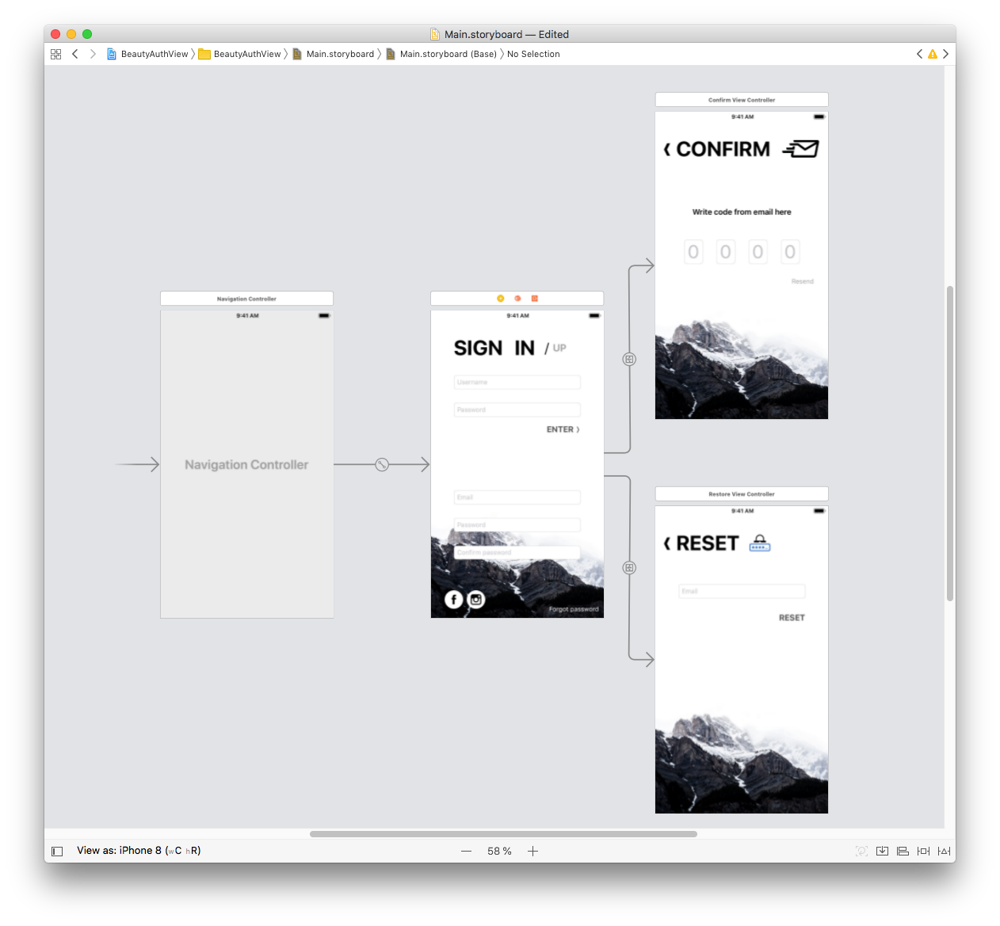

# BeautyAuthViewController

This is example of Swift realization of AuthenticationView for iOS

<table>
    <tr>
        <td>
            
        </td>
        <td>
            

                <kbd>
                    
                </kbd>
            

        </td>
    </tr>
</table>

